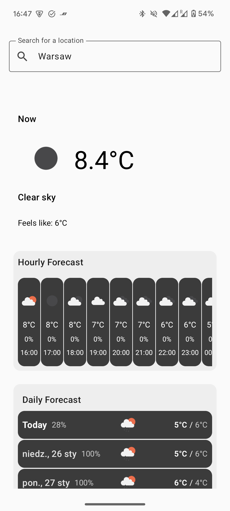
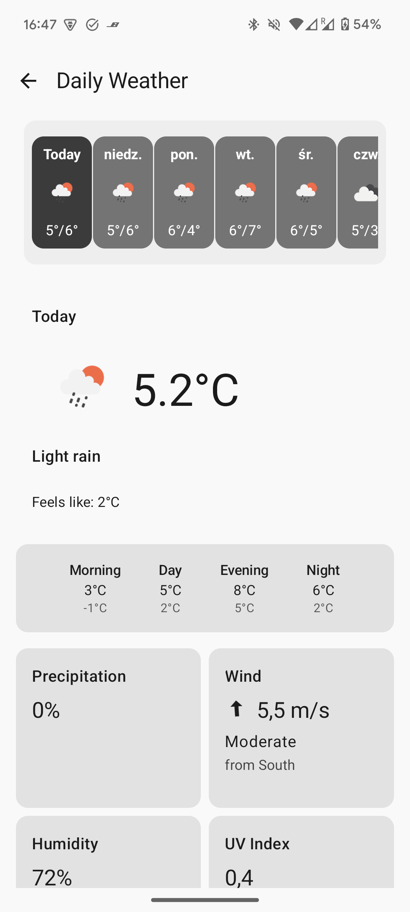

# Android Weather App

Welcome to the **Open Weather**, a lightweight and user-friendly application that provides real-time weather updates, daily forecasts, and more. Built with **Jetpack Compose**, this app showcases modern Android development practices.

## Features

- **Current Weather**: View real-time weather conditions for your selected location.
- **Daily Forecast**: Access detailed daily forecasts to plan your week.
- **Responsive UI**: A sleek, intuitive interface designed for all screen sizes.
- **Modern Architecture**: Developed using **MVVM** architecture and Jetpack Compose.

## Screenshots

<p align="center">
  
  
</p>

## Technologies Used

- **Kotlin**: 100% Kotlin-based code.
- **Jetpack Compose**: Declarative UI framework for modern Android apps.
- **Retrofit**: For network calls to fetch weather data.
- **Room Database**: To store user preferences and offline data.
- **Hilt**: Dependency injection for managing components efficiently.

## Getting Started

### Prerequisites
- Android Studio Arctic Fox or later.

### Setup Instructions

1. Clone the repository:
   ```bash
   git clone https://github.com/murano500k/OpenWeatherApp.git
   ```
2. Open the project in Android Studio.
3. Add your API key for the [OpenWeatherMap API service](https://openweathermap.org/api) provider in `local.properties`:
   ```properties
   OPEN_WEATHER_API_KEY=your_api_key_here
   ```
4. Build and run the app on your emulator or physical device.

## Contributing

Contributions are welcome! Please follow these steps:

1. Fork the repository.
2. Create a new branch for your feature or bugfix:
   ```bash
   git checkout -b feature-name
   ```
3. Commit your changes and push to your fork.
4. Open a pull request.

## License

This project is licensed under the [MIT License](LICENSE).

---

If you find this project helpful, please ⭐ the repository and share your feedback. Happy coding!
